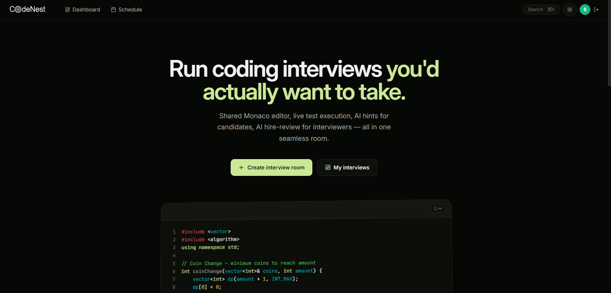
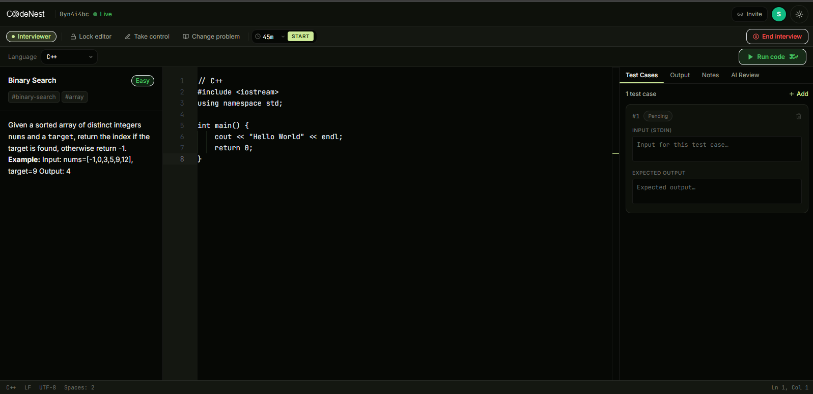
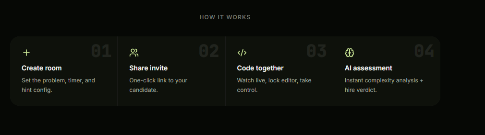

# CodeNest

**Live Demo:** [https://codenest-0xae.onrender.com](https://codenest-0xae.onrender.com)

A 2-person role-based coding interview platform. Interviewer watches. Candidate codes. Gemini gives hints. Every session is replayable.




## Tech Stack

| Layer | Tech |
|---|---|
| Frontend + API | Next.js 15 App Router |
| Real-time sync | Socket.io |
| Database | MongoDB Atlas M0 |
| Room state | Upstash Redis / Local Redis |
| Code execution | Wandbox API |
| AI hints + review | Gemini 2.0 Flash |
| Auth | NextAuth + bcrypt |
| Deployment | Render free tier |

## Quick Start

```bash
git clone https://github.com/your-username/codenest.git
cd codenest
npm install
cp .env.example .env    # fill in MONGODB_URI, NEXTAUTH_SECRET, REDIS_URL, INVITE_TOKEN_SECRET, GEMINI_API_KEY
docker-compose up -d    # or use Upstash and set REDIS_URL
npm run seed             # seeds 50 problems
node server.js
```

Visit `http://localhost:3000`

---

## How It Works



1. **Interviewer** creates a room (sets problem, timer, hint config)
2. **Interviewer** gets an invite link and shares it with the candidate
3. **Candidate** opens the invite link — joins as candidate role
4. **Interview begins** — candidate codes, interviewer watches in real-time
5. **Interviewer controls**: lock editor, take control, give AI hints, end interview
6. **AI Review** generated on demand (complexity, edge cases, hire decision)
7. **Replay** available after interview ends — scrub through snapshots

## API Reference

| Endpoint | Method | Description |
|---|---|---|
| `/api/rooms` | POST / GET | Create room + invite link / list interviewer's rooms |
| `/api/rooms/[id]` | GET | Room info + snapshots |
| `/api/rooms/[id]/invite` | GET | Get invite link |
| `/api/execute` | POST | Run code via Wandbox |
| `/api/ai/hint` | POST | Get AI hint (candidate) |
| `/api/ai/review` | POST | Get AI review (interviewer) |
| `/api/problems` | GET | List problems (paginated) |
| `/api/problems/[id]` | GET | Single problem |
| `/api/health` | GET | Health check |

## Key Socket Events

| Event | Direction | Description |
|---|---|---|
| `join-room` | Client → Server | Join with invite token |
| `code-change` | Client → Server | Code update |
| `editor-lock` / `take-control` / `return-control` | Interviewer → Server | Editor access controls |
| `problem-change` | Interviewer → Server | Switch problem |
| `timer-start` | Interviewer → Server | Start countdown |
| `interview-end` | Interviewer → Server | End interview + save snapshot |
| `interview-ended` | Server → Client | Interview over + replay link |